In case someone needs some autumn color inspiration in their figures.

``` r
y = c(1,1,1,1,1)
x = c(1,2,3,4,5)
z = c(1,2,3,4,5)
df = tibble(x,y,z)

paletteplot = function(pp) {
df %>%
  ggplot(aes(x,y,color = factor(z))) +
  geom_point(size = 35) + 
  scale_color_manual(values = pp(5)) +
  theme_void() +
  theme(legend.position = "none") +
  coord_cartesian(xlim = c(0,6), ylim = c(1,1))
}
```

### Leaves on pavement

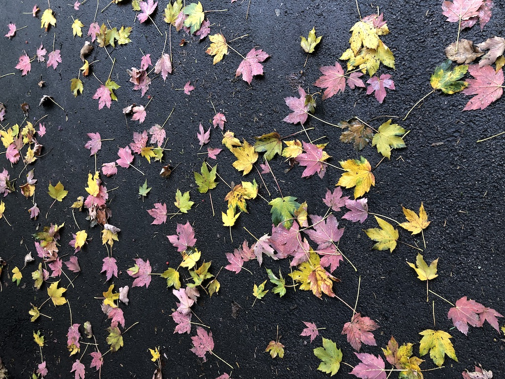

``` r
leaves = colorRampPalette(c("#040811","#689B75","#FFDD21","#F491B5","#586678"))
paletteplot(leaves)
```

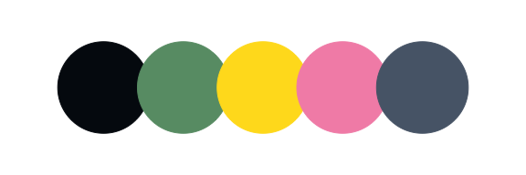

------------------------------------------------------------------------

### Red tree

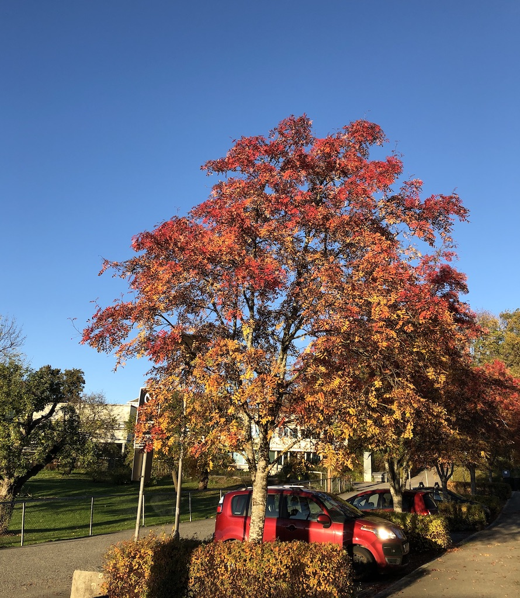

``` r
redtree = colorRampPalette(c("#4782C7","#A10000","#FF5B37","#FFC923","#FFEA99"))
paletteplot(redtree)
```

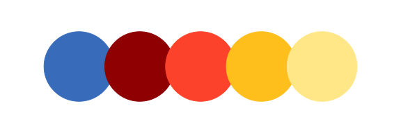

------------------------------------------------------------------------

### Tree

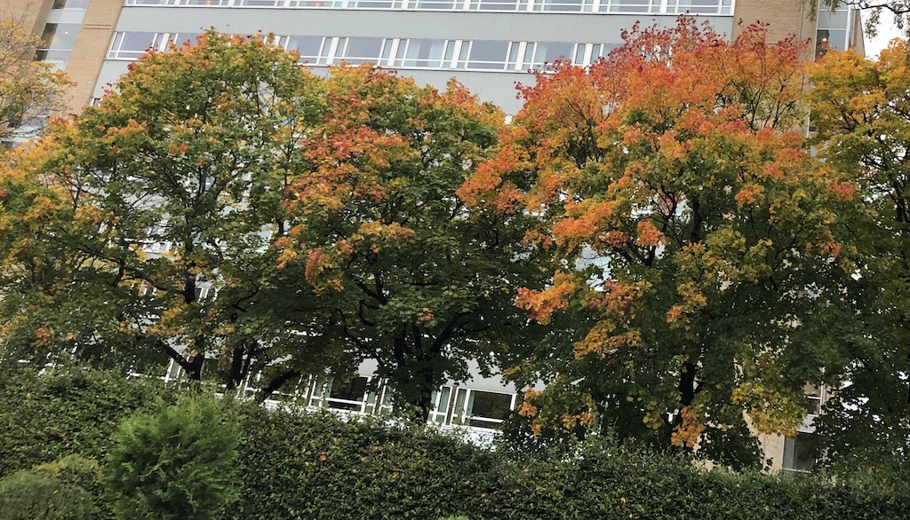

``` r
autumntree = colorRampPalette(c("#252D1B","#888143","#F4B955","#E2693D","#89361C"))
paletteplot(autumntree)
```

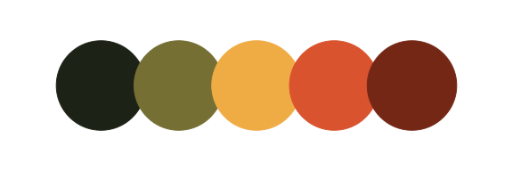

------------------------------------------------------------------------

### Bush

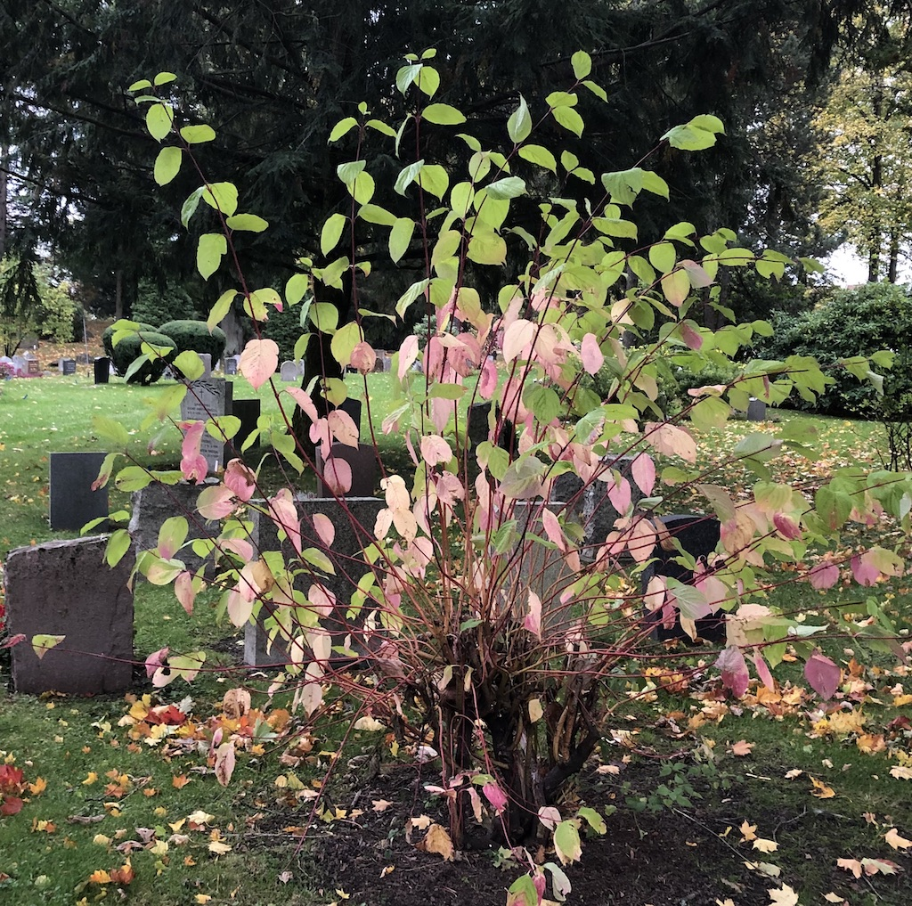

``` r
bush = colorRampPalette(c("#577933","#ADD051","#FFE1E1","#A0556A","#852B3D"))
paletteplot(bush)
```

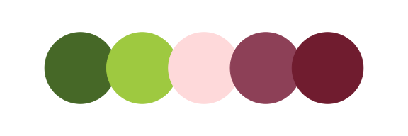

------------------------------------------------------------------------

### Leaf

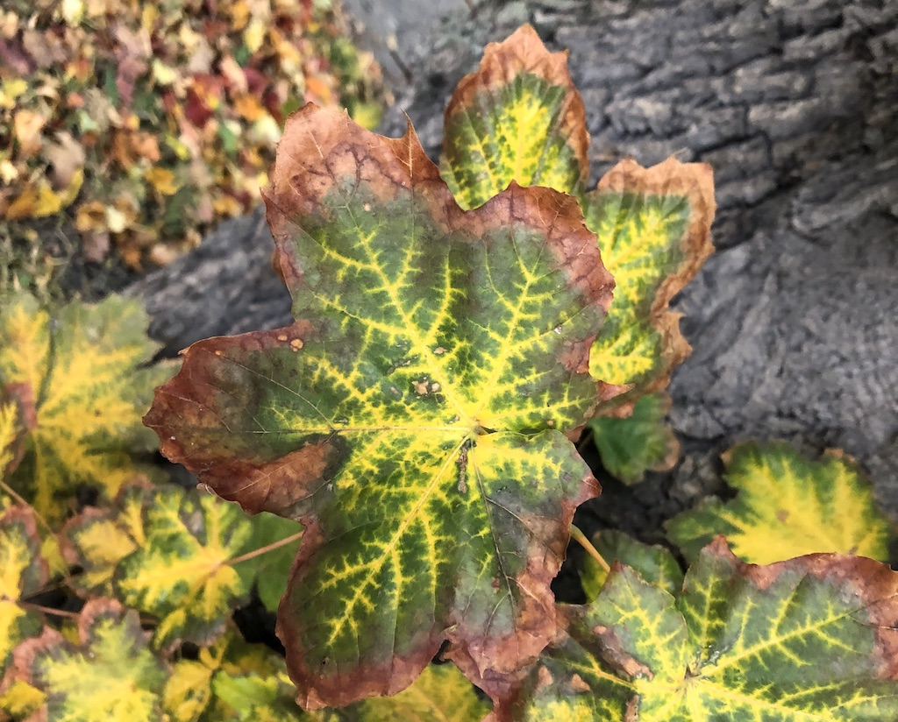

``` r
autumnleave =  colorRampPalette(c("#FFF22B","#3A561E","#899766","#814739","#D18879"))
paletteplot(autumnleave)
```

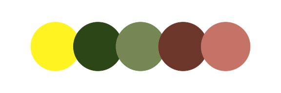

------------------------------------------------------------------------

### Underwater

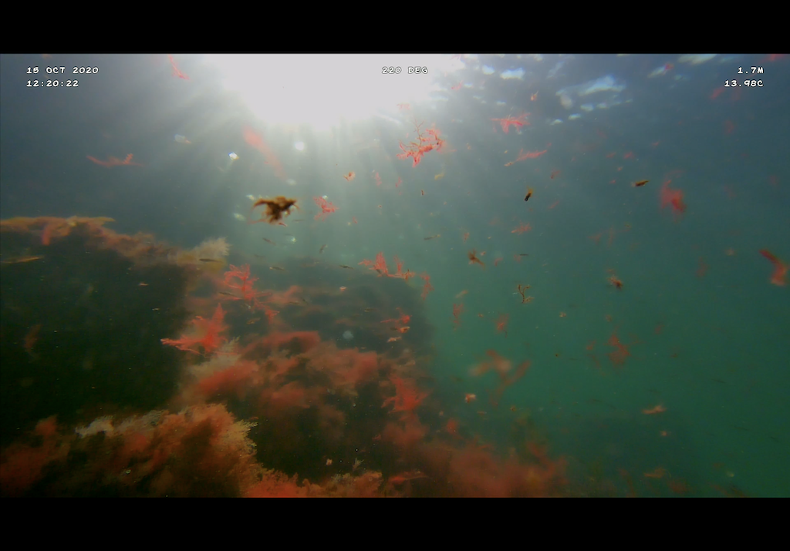

``` r
uw = colorRampPalette(c("#d5d2d4","#72a4bd","#205b47","#b0320f","#7d6136"))
paletteplot(uw)
```

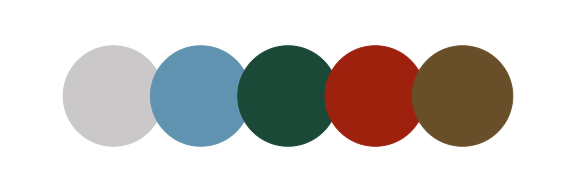

------------------------------------------------------------------------
